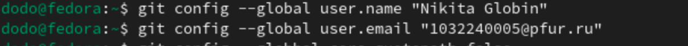

---
## Front matter
title: "ЛАБОРАТОРНАЯ РАБОТА №2"
subtitle: "Отчёт"
author: "Глобин Никита Анатольевич"

## Generic otions
lang: ru-RU
toc-title: "Содержание"

## Bibliography
bibliography: bib/cite.bib
csl: pandoc/csl/gost-r-7-0-5-2008-numeric.csl

## Pdf output format
toc: true # Table of contents
lof: true # List of figures
lot: true # List of tables
fontsize: 12pt
linestretch: 1.5
papersize: a4
documentclass: scrreprt
## I18n polyglossia
polyglossia-lang:
  name: russian
  options:
	- spelling=modern
	- babelshorthands=true
polyglossia-otherlangs:
  name: english
## I18n babel
babel-lang: russian
babel-otherlangs: english
## Fonts
mainfont: IBM Plex Serif
romanfont: IBM Plex Serif
sansfont: IBM Plex Sans
monofont: IBM Plex Mono
mathfont: STIX Two Math
mainfontoptions: Ligatures=Common,Ligatures=TeX,Scale=0.94
romanfontoptions: Ligatures=Common,Ligatures=TeX,Scale=0.94
sansfontoptions: Ligatures=Common,Ligatures=TeX,Scale=MatchLowercase,Scale=0.94
monofontoptions: Scale=MatchLowercase,Scale=0.94,FakeStretch=0.9
mathfontoptions:
## Biblatex
biblatex: true
biblio-style: "gost-numeric"
biblatexoptions:
  - parentracker=true
  - backend=biber
  - hyperref=auto
  - language=auto
  - autolang=other*
  - citestyle=gost-numeric
## Pandoc-crossref LaTeX customization
figureTitle: "Рис."
tableTitle: "Таблица"
listingTitle: "Листинг"
lofTitle: "Список иллюстраций"
lotTitle: "Список таблиц"
lolTitle: "Листинги"
## Misc options
indent: true
header-includes:
  - \usepackage{indentfirst}
  - \usepackage{float} # keep figures where there are in the text
  - \floatplacement{figure}{H} # keep figures where there are in the text
---

# Цель работы

Целью работы является изучение идеологии и применение средств контроля версий.
Приобретение практических навыков с системой git.

# Задание

Базовая настройка git  
Создание члюч SSH  
Создание ключ GPG  
Настройки подписи git  
Зарегистрироваться на github  
Создать локальный каталог для выполнения заданий по предмету  

# Выполнение лабораторной работы

## Задание №1. Базовая настройка git

1.  Сначала сделаем предварительную конфигурацию git. Откройте терминал и введите
следующие команды, указав имя и email владельца репозитория:
git config --global user.name “<Name Surname>” git
config --global user.email “<work@mail>”
Рис. 1.1. Задаём имя и email репозитория.

{#fig:000 width=70%}

2. Настроим utf-8 в выводе сообщений git:
git config --global core.quotepath false
Рис. 1.2. Настраиваем utf-8.

{#fig:001 width=70%}

3. Зададим имя начальной ветки (будем называть её master):
git config --global init.defaultBranch master
Рис. 1.3. Задаём имя начальной ветки (master).

{#fig:002 width=70%}

4. Параметр autocrlf:
git config --global core.autocrlf input
Рис. 1.4. Устанавливаем параметр autocrlf.

{#fig:003 width=70%}

5. Параметр safecrlf:
Рис. 1.5. Устанавливаем настройку safecrlf.

{#fig:004 width=70%}

## Задание №2. Создание SSH ключа.

Для последующей идентификации пользователя на сервере репозиториев необходимо
сгенерировать пару ключей (приватный и открытый):
ssh-keygen -C “Имя Фамилия <work@mail>”
Рис. 2.1. Генерируем пару ключей.

{#fig:005 width=70%}

Ключи сохранятся в каталоге ~/.ssh/.
Далее необходимо загрузить сгенерённый ключ.
Скопировав ключ из локальной сети в буфер обмена, вставляем его в поле на сайте. cat
~/.ssh/id_rsa.pub | xclip -sel clip
Рис. 2.2. Копируем ключ из локальной сети в буфер обмена.

{#fig:006 width=70%}

Заходим в свой аккаунт на сайте github и переходим в настройки, добавляем
скопированный ключ и указываем имя ключа (Title).
Рис. 2.3. Проверяем добавление ключа.

{#fig:007 width=70%}

##Задание №3. Создание рабочего пространства и репозитория курса на основе шаблона.

Открываем терминал для создания рабочего пространства.
Рис. 3.1. Создаём каталог для предмета «Архитектура компьютера».

{#fig:008 width=70%}

##Задание №4. Создание репозитория курса.

Переходим на страницу репозитория с шаблоном.
Рис. 4.1. Создаём репозиторий по шаблону и называем его «study_2024–2025_arh-pc».

{#fig:009 width=70%}

Открываем терминал:
Рис. 4.2. Переходим в каталог курса и клонируем созданный репозиторий.

{#fig:010 width=70%}

## Задание №5. Настройка каталога курса.

Рис. 5.1. Переходим в каталог курса.

{#fig:011 width=70%}

Рис. 5.2. Удаляем лишние файлы.

{#fig:012 width=70%}

Рис. 5.3. Создаем необходимые каталоги.

{#fig:013 width=70%}

Рис. 5.4. Отслеживаем файл и записываем изменения в репозиторий.

{#fig:014 width=70%}

Рис. 5.5. Отправляем файлы на сервер.

{#fig:015 width=70%}

{#fig:016 width=70%}

# Выводы

В ходе выполнения лабораторной работы я познакомился с системой git, и научился ей
пользоваться.

