---
## Front matter
title: "Лабораторная работа №4"
subtitle: "отчёт"
author: "Глобин Никита Анатольевич"

## Generic otions
lang: ru-RU
toc-title: "Содержание"

## Bibliography
bibliography: bib/cite.bib
csl: pandoc/csl/gost-r-7-0-5-2008-numeric.csl

## Pdf output format
toc: true # Table of contents
toc-depth: 2
lof: true # List of figures
lot: true # List of tables
fontsize: 12pt
linestretch: 1.5
papersize: a4
documentclass: scrreprt
## I18n polyglossia
polyglossia-lang:
  name: russian
  options:
	- spelling=modern
	- babelshorthands=true
polyglossia-otherlangs:
  name: english
## I18n babel
babel-lang: russian
babel-otherlangs: english
## Fonts
mainfont: IBM Plex Serif
romanfont: IBM Plex Serif
sansfont: IBM Plex Sans
monofont: IBM Plex Mono
mathfont: STIX Two Math
mainfontoptions: Ligatures=Common,Ligatures=TeX,Scale=0.94
romanfontoptions: Ligatures=Common,Ligatures=TeX,Scale=0.94
sansfontoptions: Ligatures=Common,Ligatures=TeX,Scale=MatchLowercase,Scale=0.94
monofontoptions: Scale=MatchLowercase,Scale=0.94,FakeStretch=0.9
mathfontoptions:
## Biblatex
biblatex: true
biblio-style: "gost-numeric"
biblatexoptions:
  - parentracker=true
  - backend=biber
  - hyperref=auto
  - language=auto
  - autolang=other*
  - citestyle=gost-numeric
## Pandoc-crossref LaTeX customization
figureTitle: "Рис."
tableTitle: "Таблица"
listingTitle: "Листинг"
lofTitle: "Список иллюстраций"
lotTitle: "Список таблиц"
lolTitle: "Листинги"
## Misc options
indent: true
header-includes:
  - \usepackage{indentfirst}
  - \usepackage{float} # keep figures where there are in the text
  - \floatplacement{figure}{H} # keep figures where there are in the text
---

# Цель работы

Освоение процедуры компиляции и сборки программ, написанных на ассемблере NASM.
# Задание

написать программу Hello world!  
использование транслятора NASM  
использование компоновщика LD  
Запуск исполняемого файла  
создание копии файла с выводом имени и фамилии  
отправка этих файлов на githab  

# Выполнение лабораторной работы

## Программа Hello world!

1. Переходим в котолог и создаём там фаил с расширением .asm
cd ~/work/arch-pc/lab04

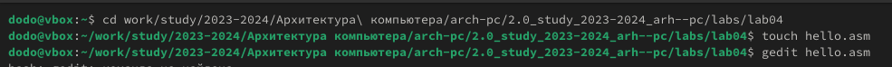{#fig:001 width=70%}

2. открываем созданный фаил и пишем в нём программу
gedit hello.asm

; hello.asm
SECTION .data ; Начало секции данных
hello: DB 'Hello world!',10 ; 'Hello world!' плюс
; символ перевода строки
helloLen: EQU $-hello ; Длина строки hello
SECTION .text ; Начало секции кода
GLOBAL _start
_start: ; Точка входа в программу
mov eax,4 ; Системный вызов для записи (sys_write)
mov ebx,1 ; Описатель файла '1' - стандартный вывод
mov ecx,hello ; Адрес строки hello в ecx
mov edx,helloLen ; Размер строки hello
int 80h ; Вызов ядра
mov eax,1 ; Системный вызов для выхода (sys_exit)
mov ebx,0 ; Выход с кодом возврата '0' (без ошибок)
int 80h ; Вызов ядра

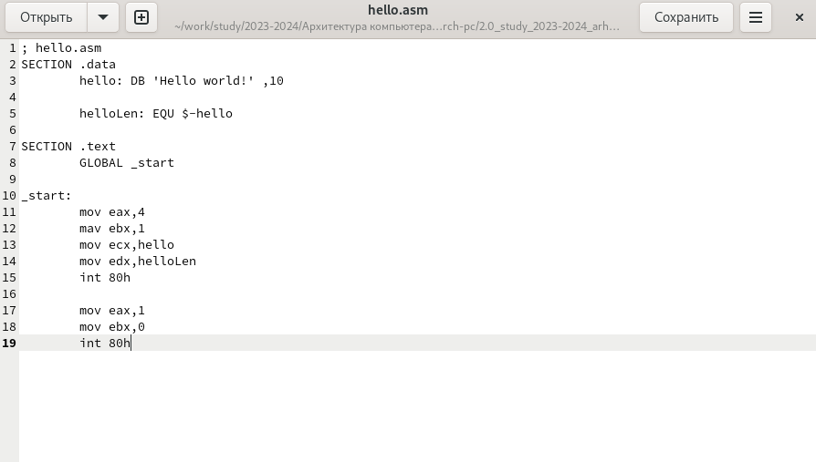{#fig:002 width=70%}

## Транслятор NASM

1. используя транслятор NASM начинаем работать с нашим файлом
nasm -f elf hello.asm

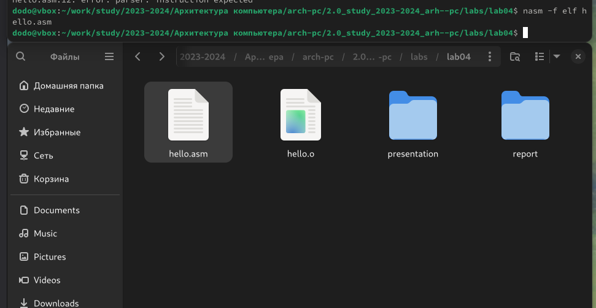{#fig:003 width=70%}

2. используем расширенный функционал NASM
nasm -o obj.o -f elf -g -l list.lst hello.asm

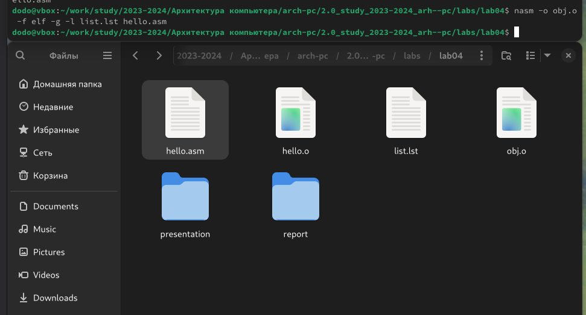{#fig:004 width=70%}

## Компоновщик LD

1. отдаём фаил компоновщику LD для получения исполняемую программу
d -m elf_i386 hello.o -o hello

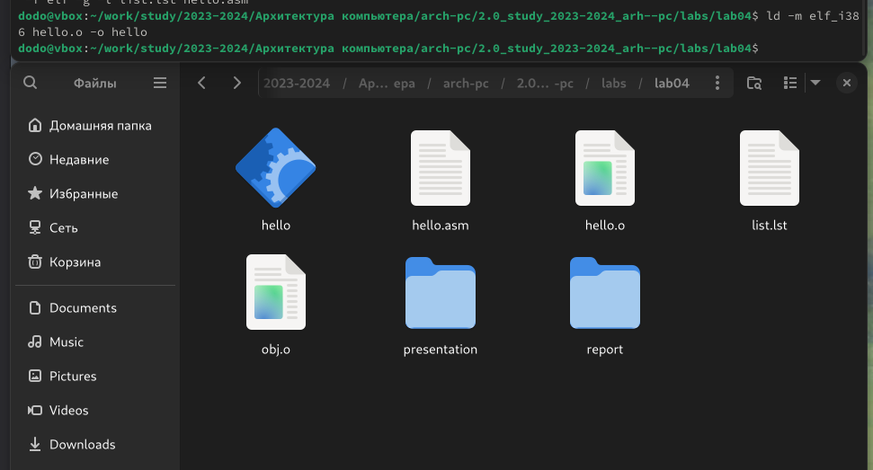{#fig:005 width=70%}

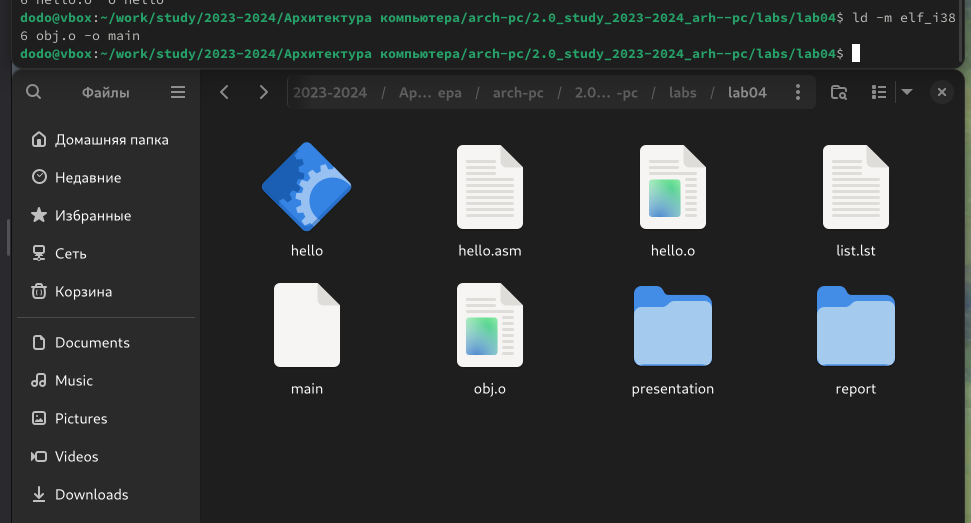{#fig:006 width=70%}

## Запуск исполняемого файла

1. запускаем фаил
./hello

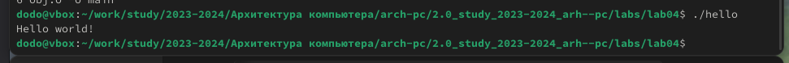{#fig:007 width=70%}

## самостоятельная работа

1. создаём копию файла при помщoи команды cp и называем копию lab4.asm

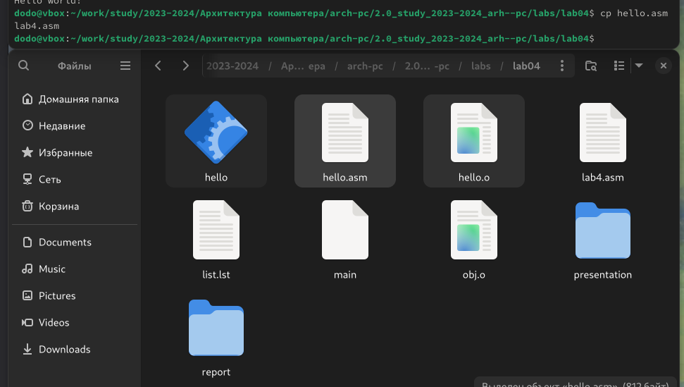{#fig:008 width=70%}

2. использую текстовый редактор переписываем программ так чтобы она выводила имя и фамилию

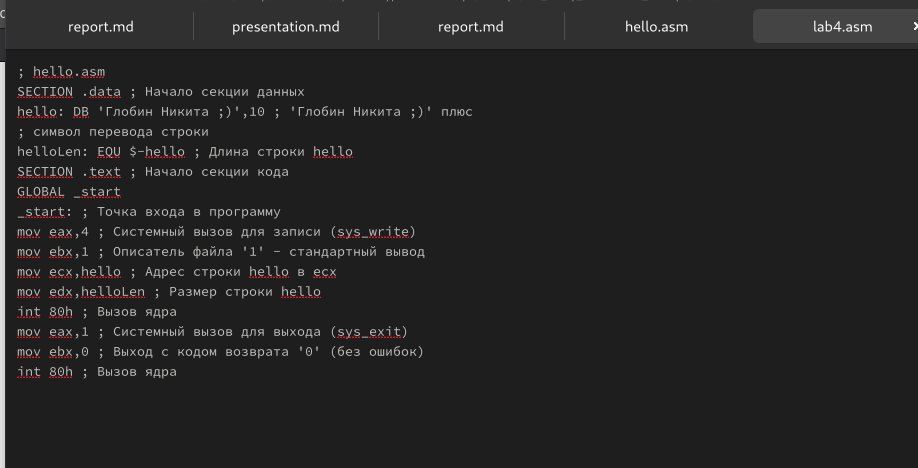{#fig:009 width=70%}

3. компилируем и запускаем нашу программу

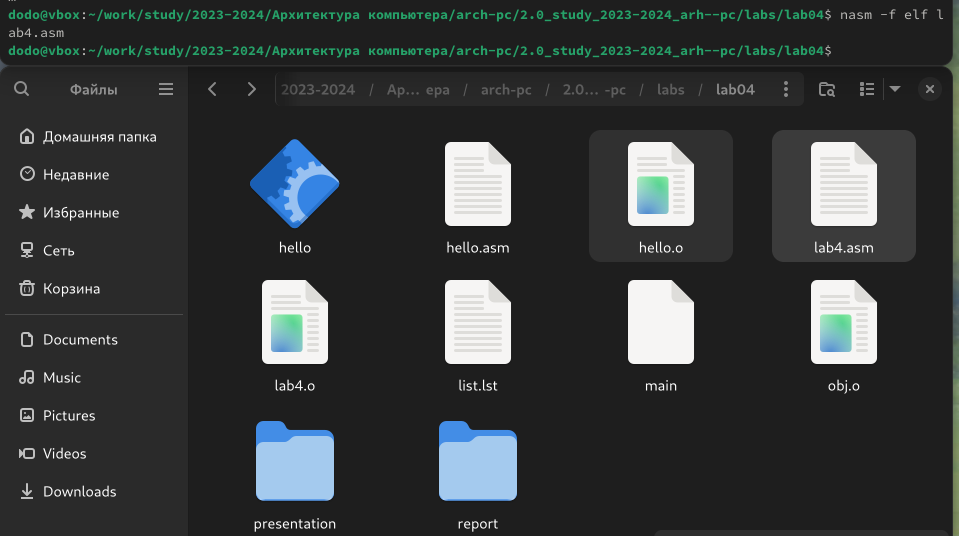{#fig:010 width=70%}

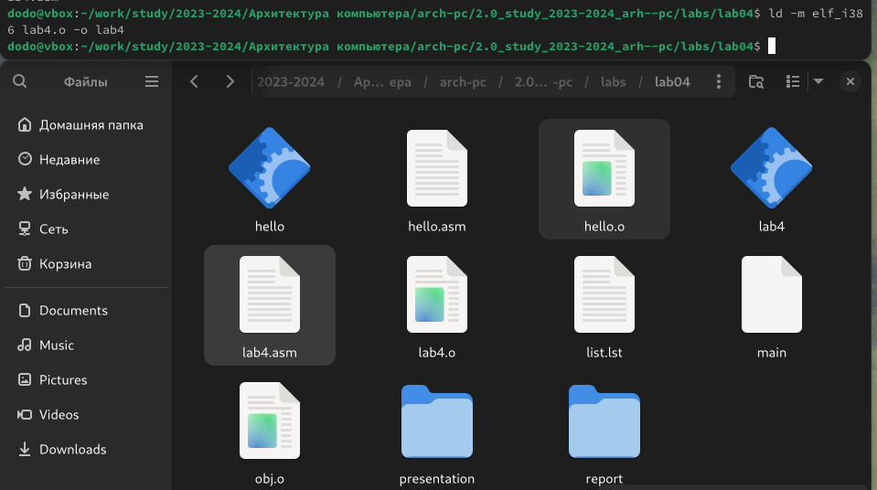{#fig:011 width=70%}

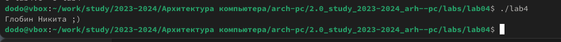{#fig:011 width=70%}

# Выводы

Здесь кратко описываются итоги проделанной работы.

# Список литературы{.unnumbered}

::: {#refs}
:::
