---
## Front matter
title: "ЛАБОРАТОРНАЯ РАБОТА №5"
subtitle: "Отчёт"
author: "Глобин Никита Анатольевич"

## Generic otions
lang: ru-RU
toc-title: "Содержание"

## Bibliography
bibliography: bib/cite.bib
csl: pandoc/csl/gost-r-7-0-5-2008-numeric.csl

## Pdf output format
toc: true # Table of contents
toc-depth: 2
lof: true # List of figures
lot: true # List of tables
fontsize: 12pt
linestretch: 1.5
papersize: a4
documentclass: scrreprt
## I18n polyglossia
polyglossia-lang:
  name: russian
  options:
	- spelling=modern
	- babelshorthands=true
polyglossia-otherlangs:
  name: english
## I18n babel
babel-lang: russian
babel-otherlangs: english
## Fonts
mainfont: IBM Plex Serif
romanfont: IBM Plex Serif
sansfont: IBM Plex Sans
monofont: IBM Plex Mono
mathfont: STIX Two Math
mainfontoptions: Ligatures=Common,Ligatures=TeX,Scale=0.94
romanfontoptions: Ligatures=Common,Ligatures=TeX,Scale=0.94
sansfontoptions: Ligatures=Common,Ligatures=TeX,Scale=MatchLowercase,Scale=0.94
monofontoptions: Scale=MatchLowercase,Scale=0.94,FakeStretch=0.9
mathfontoptions:
## Biblatex
biblatex: true
biblio-style: "gost-numeric"
biblatexoptions:
  - parentracker=true
  - backend=biber
  - hyperref=auto
  - language=auto
  - autolang=other*
  - citestyle=gost-numeric
## Pandoc-crossref LaTeX customization
figureTitle: "Рис."
tableTitle: "Таблица"
listingTitle: "Листинг"
lofTitle: "Список иллюстраций"
lotTitle: "Список таблиц"
lolTitle: "Листинги"
## Misc options
indent: true
header-includes:
  - \usepackage{indentfirst}
  - \usepackage{float} # keep figures where there are in the text
  - \floatplacement{figure}{H} # keep figures where there are in the text
---

# Цель работы

Приобретение практических навыков работы в Midnight Commander. Освоение инструкций
языка ассемблера mov и int.
# Задание

Открыть и воспользоваться Midnight Commander  
Создание и работа с файлом через Midnight Commander  
Запуск полученной программы  
Подключение внешнего файла in_out.asm и создание копии файла через Midnight Commander  
Самостоятельная работа  

# Выполнение лабораторной работы

## Открыть и воспользоваться Midnight Commander

1. Открываем терминал и водим команду mc (рис. [-@fig:001])

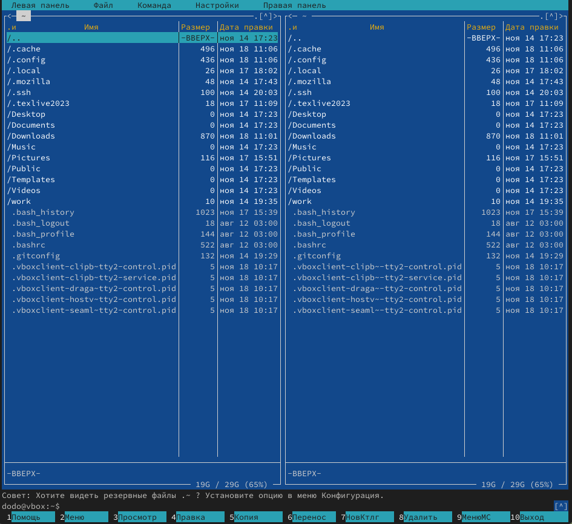{#fig:001 width=70%}

2. Используя функционал Midnight Commander, переходим в папку lab05 (рис. [-@fig:002])

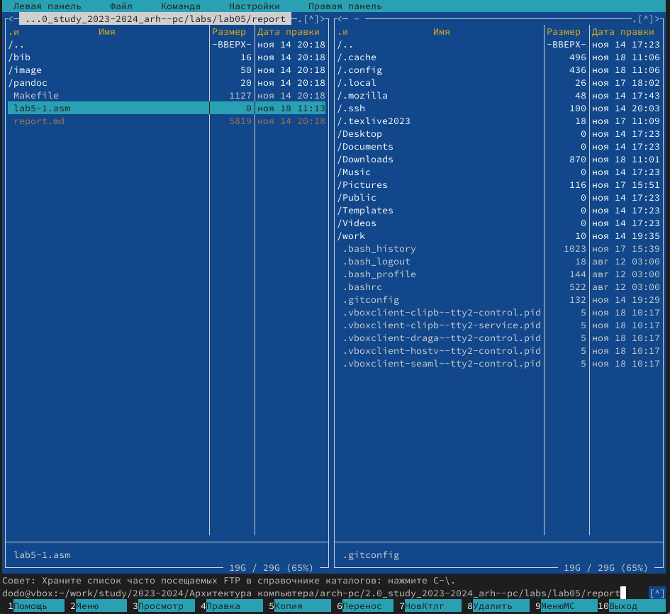{#fig:002 width=70%}

## Создание и работа с файлом через Midnight Commander

 1. Создаём фаил и lab5-1 (рис. [-@fig:003])
 
 {#fig:003 width=70%}
 
 2. записываем в него программу (рис. [-@fig:004])
 
  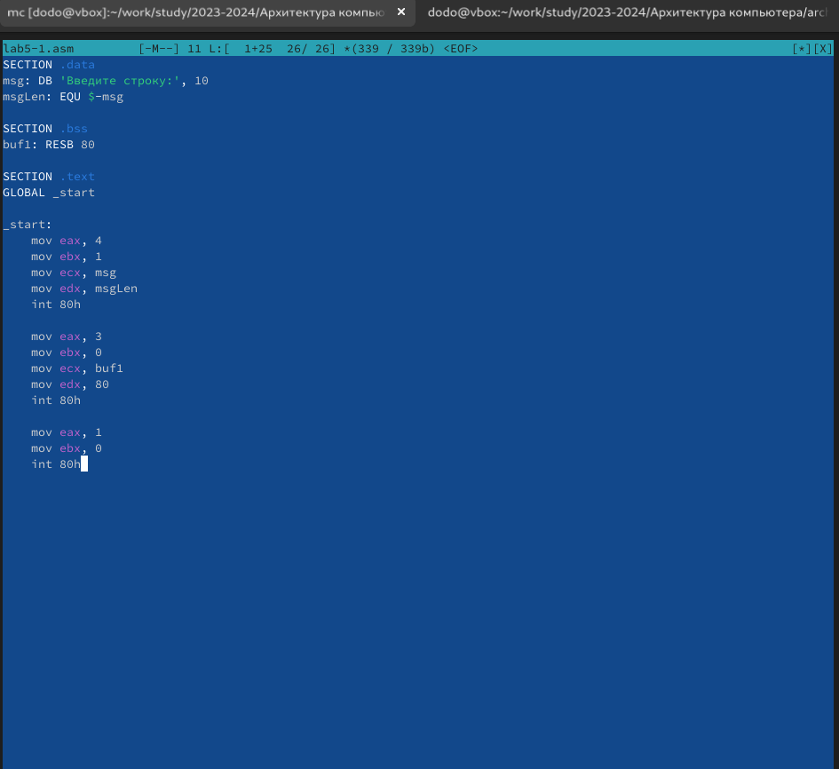{#fig:004 width=70%}
  
 3. Сохраняем программу и выходим. Затем через клавишу F3 проверяем схоронился ли файл (рис. [-@fig:005])
 
   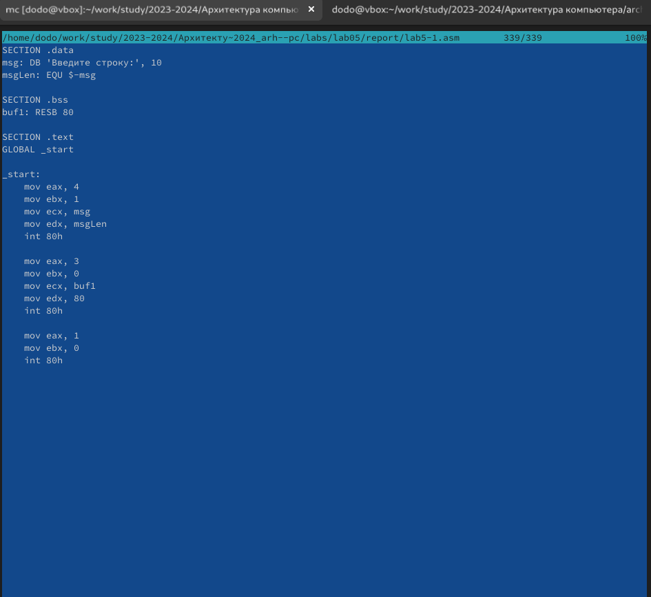{#fig:005 width=70%}

## Запуск полученной программы

1. компилируем полученный файл и вводим туда свою фамилию и имя (рис. [-@fig:006])

   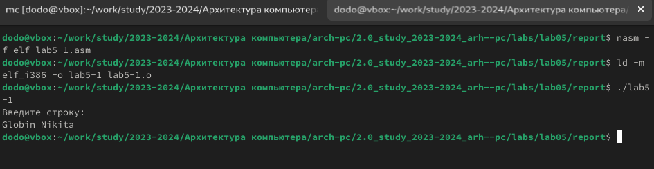{#fig:006 width=70%}
   

## Подключение внешнего файла in_out.asm и создание копии файла через Midnight Commander 

1. скачиваем и переносим файл in_out.asm в нашу папку с файлом (рис. [-@fig:007])

   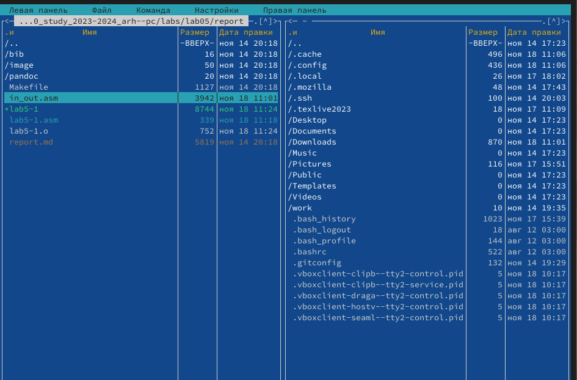{#fig:007 width=70%}

2. С помощью функциональной клавиши F6 создайтём копию файла lab5-1.asm с именем lab5-2.asm. (рис. [-@fig:008])

   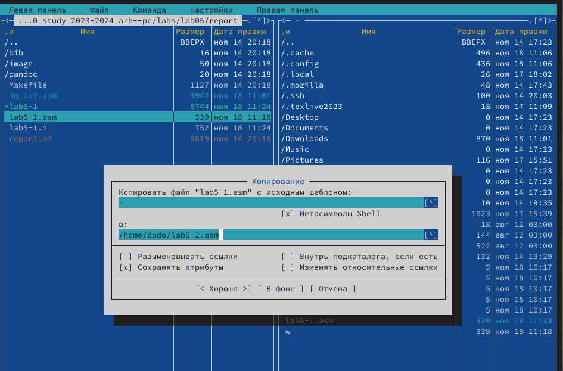{#fig:008 width=70%}
   
3. Исправляем текст программы в файле lab5-2.asm с использованием подпрограмм из внешнего файла in_out.asm (рис. [-@fig:009])

   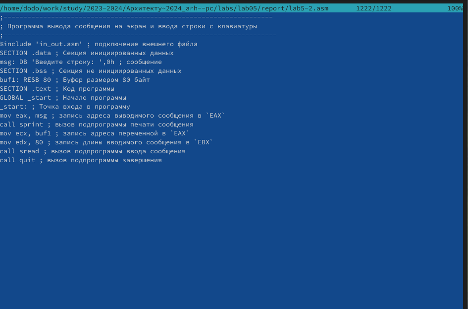{#fig:009 width=70%}
   
4. компилируем и запускаем эту программу (рис. [-@fig:010])

   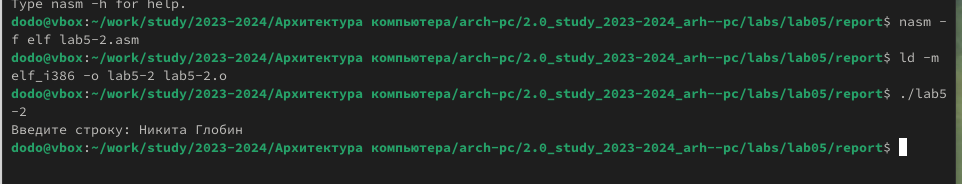{#fig:0010 width=70%}

## Самостоятельная работа

1. Создаём копию файла lab5-1.asm и пишем программу котороя будет выполнять (рис. [-@fig:011]) (рис. [-@fig:012]) :
    • вывести приглашение типа “Введите строку:”;
    • ввести строку с клавиатуры;
    • вывести введённую строку на экран.
    
{#fig:0011 width=70%} 
 
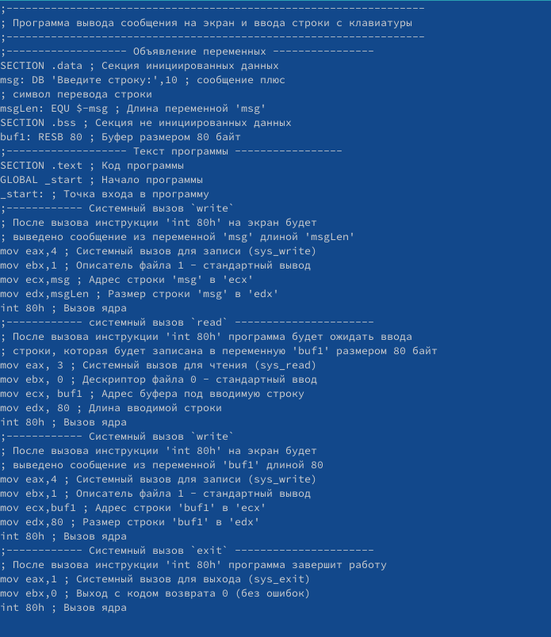{#fig:0012 width=70%} 

2. запускаем программу (рис. [-@fig:013])

    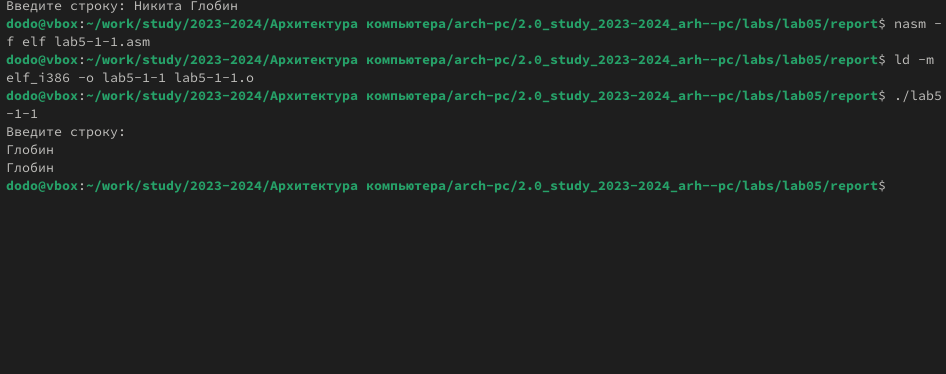{#fig:0013 width=70%} 
    
3. Создаём копию файла lab5-2.asm и пишем программу котороя будет выполнять (рис. [-@fig:014]) (рис. [-@fig:015]) :
    • вывести приглашение типа “Введите строку:”;
    • ввести строку с клавиатуры;
    • вывести введённую строку на экран.

    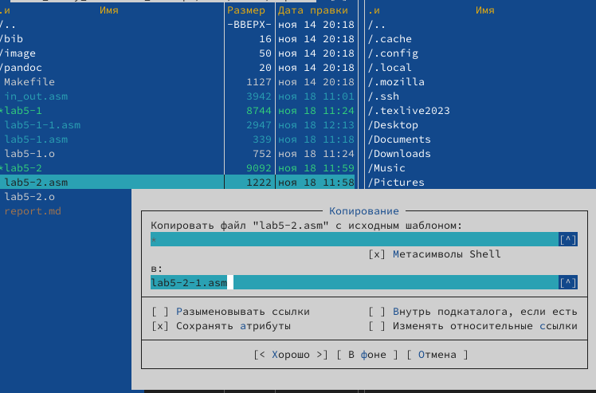{#fig:0014 width=70%} 
    
    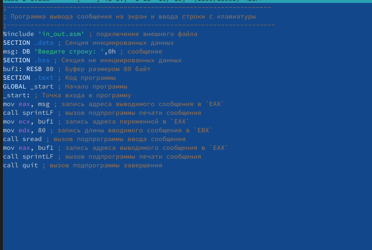{#fig:0015 width=70%} 

4. запускаем программу (рис. [-@fig:016])

    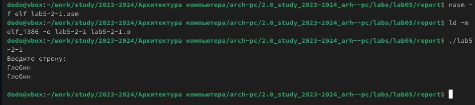{#fig:0016 width=70%} 

# Выводы

В ходе лабораторной работы я приобрёл навык работы в Midnight Commander. Освоение инструкций
языка ассемблера mov и int. Теперь я могу писать простейшие программы на asm и использовать Midnight Commander, что в свою очередь улучило моё понимание компьютера. 

# Список литературы{.unnumbered}

