---
## Front matter
title: "Лабораторная работа №6"
subtitle: "Арифметические операции в NASM"
author: "Глобин Никита Анатольевич"

## Generic otions
lang: ru-RU
toc-title: "Содержание"

## Bibliography
bibliography: bib/cite.bib
csl: pandoc/csl/gost-r-7-0-5-2008-numeric.csl

## Pdf output format
toc: true # Table of contents
toc-depth: 2
lof: true # List of figures
lot: true # List of tables
fontsize: 12pt
linestretch: 1.5
papersize: a4
documentclass: scrreprt
## I18n polyglossia
polyglossia-lang:
  name: russian
  options:
	- spelling=modern
	- babelshorthands=true
polyglossia-otherlangs:
  name: english
## I18n babel
babel-lang: russian
babel-otherlangs: english
## Fonts
mainfont: PT Serif
romanfont: PT Serif
sansfont: PT Sans
monofont: PT Mono
mainfontoptions: Ligatures=TeX
romanfontoptions: Ligatures=TeX
sansfontoptions: Ligatures=TeX,Scale=MatchLowercase
monofontoptions: Scale=MatchLowercase,Scale=0.9
## Biblatex
biblatex: true
biblio-style: "gost-numeric"
biblatexoptions:
  - parentracker=true
  - backend=biber
  - hyperref=auto
  - language=auto
  - autolang=other*
  - citestyle=gost-numeric
## Pandoc-crossref LaTeX customization
figureTitle: "Рис."
tableTitle: "Таблица"
listingTitle: "Листинг"
lofTitle: "Список иллюстраций"
lotTitle: "Список таблиц"
lolTitle: "Листинги"
## Misc options
indent: true
header-includes:
  - \usepackage{indentfirst}
  - \usepackage{float} # keep figures where there are in the text
  - \floatplacement{figure}{H} # keep figures where there are in the text
---

# Цель работы

Освоение арифметических инструкций языка ассемблера NASM.

# Задание

Символьные и численные данные в NASM  
Выполнение арифметических операций в NASM  
Ответы на вопросы  
Задание для самостоятельной работы  

# Выполнение лабораторной работы

## Символьные и численные данные в NASM

1. переходим в катал lab06 и создаём там файл lab6-1.asm (рис. [-@fig:001]).

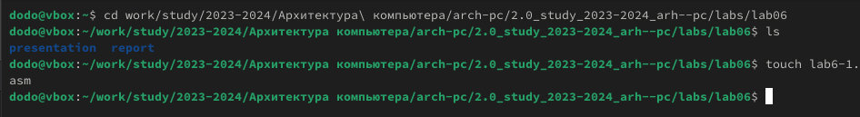{#fig:001 width=70%}

переписываем код программы из ТУИС (рис. [-@fig:002]).

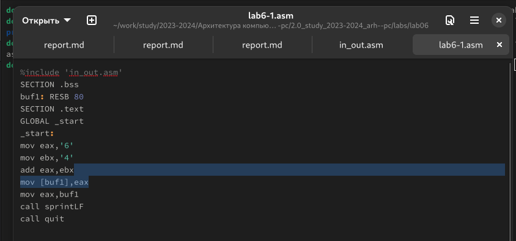{#fig:002 width=70%}

компилируем и запускаем (рис. [-@fig:003]).

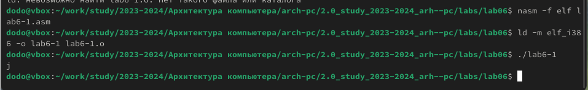{#fig:003 width=70%}

2. Далее изменим текст программы и вместо символов, запишем в регистры числа. (рис. [-@fig:004]).

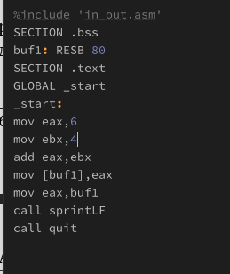{#fig:004 width=70%}

компилируем и запускаем (рис. [-@fig:005]).

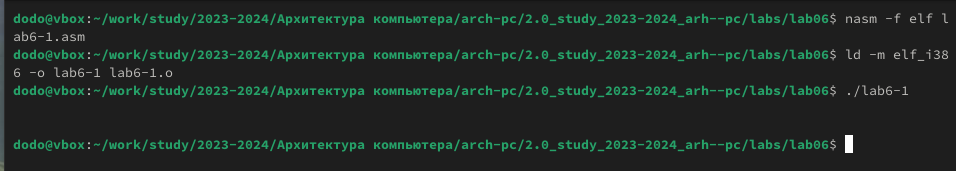{#fig:005 width=70%}

3. создаём новый файл lab6-2 (рис. [-@fig:006]).

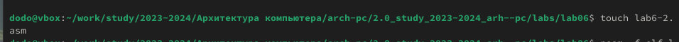{#fig:006 width=70%}

переписываем код программы из ТУИС (рис. [-@fig:007]).

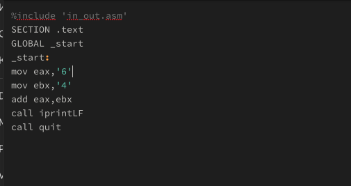{#fig:007 width=70%}

компилируем и запускаем (рис. [-@fig:008]).

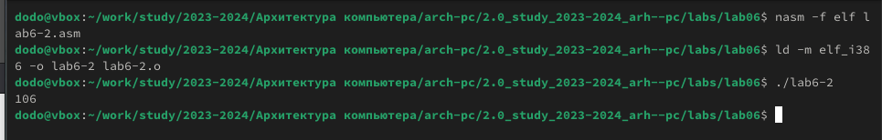{#fig:008 width=70%}

4. Аналогично предыдущему примеру изменим символы на числа (рис. [-@fig:009]).

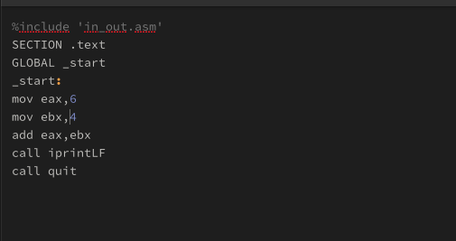{#fig:009 width=70%}

компилируем и запускаем (рис. [-@fig:010]).

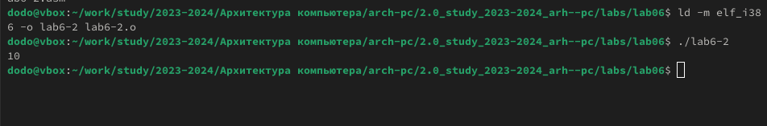{#fig:010 width=70%}

5. Заменим функцию iprintLF на iprint и выведи это (рис. [-@fig:011]).

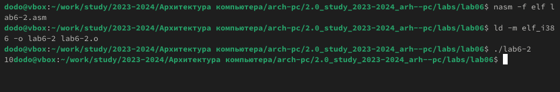{#fig:011 width=70%}

теперь ответ не пишется в отдельной строке.

## Выполнение арифметических операций в NASM

1. Создаём файл lab6-3.asm в каталоге ~/work/arch-pc/lab06 (рис. [-@fig:012]).

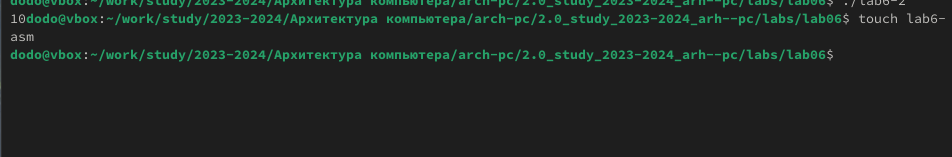{#fig:012 width=70%}

2. переписываем код программы из ТУИС (рис. [-@fig:013]).

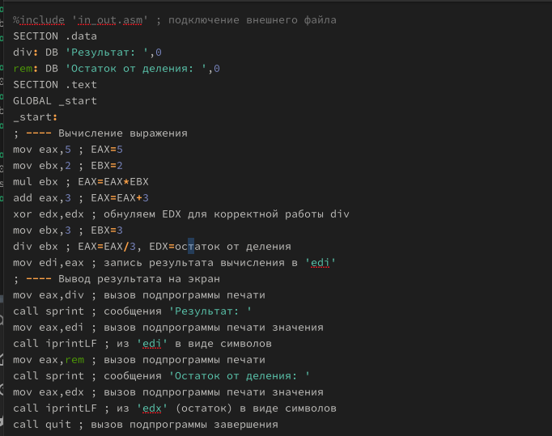{#fig:013 width=70%}

3. компилируем и запускаем (рис. [-@fig:014]).

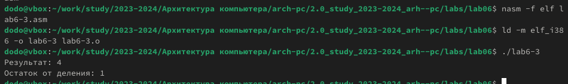{#fig:014 width=70%}

4. Изменяем текст программы для вычисления выражения f(x) = (4 * 6 + 2)/5 (рис. [-@fig:015]).

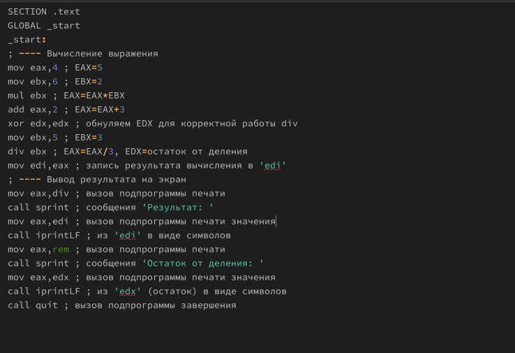{#fig:015 width=70%}

5. компилируем и запускаем (рис. [-@fig:016]).

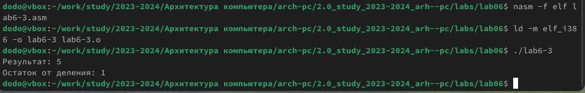{#fig:016 width=70%}

6. В качестве другого примера рассмотрим программу вычисления варианта задания по номеру студенческого билета, работающую по следующему алгоритму (рис. [-@fig:017]).

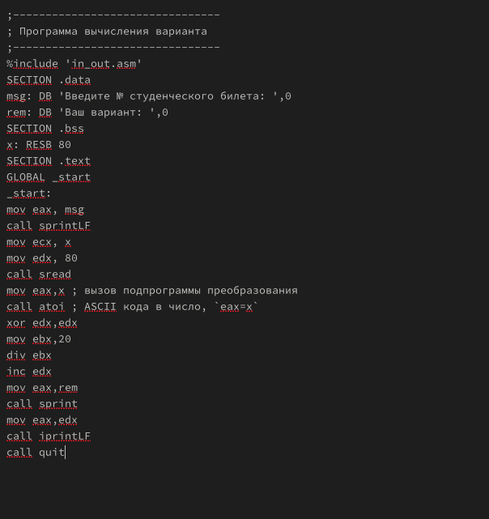{#fig:017 width=70%}

7. компилируем и запускаем (рис. [-@fig:018]).

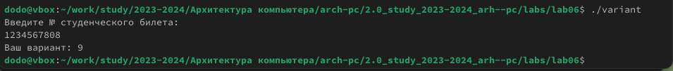{#fig:018 width=70%}

## Ответы на вопросы

1. Какие строки листинга 6.4 отвечают за вывод на экран сообщения ‘Ваш вариант:’?
Строки:

mov eax, rem     ; Загрузка адреса сообщения "Ваш вариант:" в регистр EAX
call sprint      ; Вызов подпрограммы для вывода сообщения

2. Для чего используются следующие инструкции?
mov ecx, x
Устанавливает указатель на буфер x, куда будет записан введённый текст.

mov edx, 80
Указывает максимальную длину ввода (80 байт).

call sread
Вызывает подпрограмму для считывания строки из ввода (с клавиатуры) и записи её в буфер x.

3. Для чего используется инструкция call atoi?
Она преобразует строку (символы ASCII) из буфера x в число и записывает результат в регистр eax. Это необходимо для выполнения арифметических операций с введёнными данными.

4. Какие строки листинга 6.4 отвечают за вычисление варианта?
Строки:

xor edx, edx     ; Обнуление регистра EDX
mov ebx, 20      ; Загрузка делителя (20) в EBX
div ebx          ; Деление: результат в EAX, остаток в EDX
inc edx          ; Увеличение остатка на 1 для получения номера варианта

5. В какой регистр записывается остаток от деления при выполнении инструкции div ebx?
Остаток от деления записывается в регистр EDX.

6. Для чего используется инструкция inc edx?
Инструкция inc edx увеличивает остаток от деления на единицу. Это необходимо, чтобы результат вычисления соответствовал формуле:

7. Какие строки листинга 6.4 отвечают за вывод на экран результата вычислений?
Строки:

mov eax, rem     ; Загрузка адреса сообщения "Ваш вариант:" в EAX
call sprint      ; Вывод сообщения
mov eax, edx     ; Загрузка номера варианта из EDX в EAX
call iprintLF    ; Вывод номера варианта с переводом строки

## Задание для самостоятельной работы

1. создаём файл (рис. [-@fig:019]).

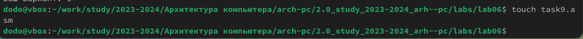{#fig:019 width=70%}

2. пишем в нём код (рис. [-@fig:020]).

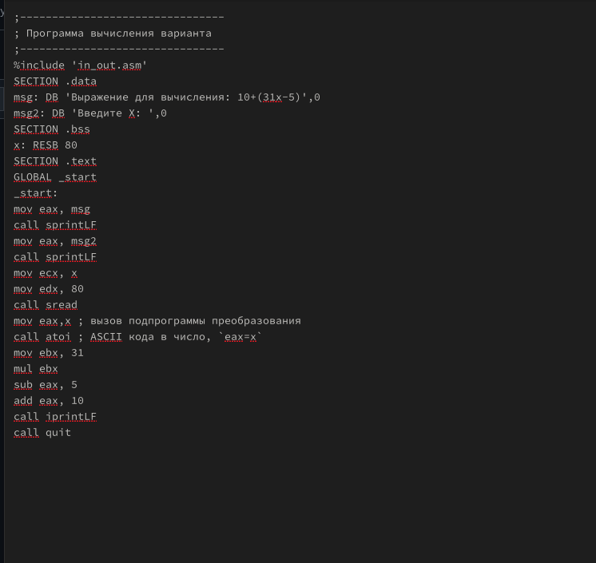{#fig:020 width=70%}

3. компилируем и запускаем (рис. [-@fig:021]).

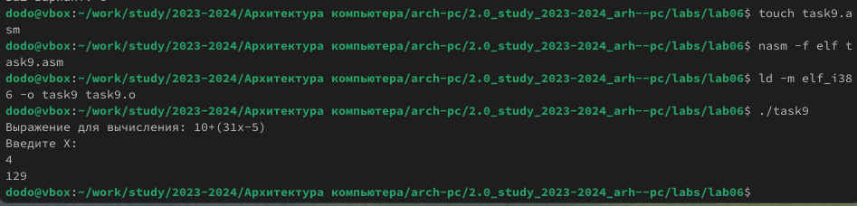{#fig:021 width=70%}

## Выводы

В результате выполнения лабораторной работы были достигнуты следующие результаты, соответствующие поставленной цели:

1. Освоение арифметических инструкций NASM:
Были изучены основные команды языка ассемблера для выполнения арифметических операций: сложение (add), вычитание (sub), умножение (mul и imul), деление (div и idiv), а также инкремент и декремент (inc, dec).

2. Работа с числовыми и символьными данными:
Изучены методы преобразования данных между символьным и числовым представлением с использованием ASCII-кодов и специальных подпрограмм (atoi, iprint и др.). Это позволило корректно вводить данные с клавиатуры и выводить результаты на экран.

3. Практическое применение арифметических операций:
Было успешно реализовано вычисление сложных арифметических выражений на языке NASM с учётом правил адресации данных и особенностей использования регистров.

4. Закрепление навыков программирования на ассемблере:
Выполнение лабораторной работы позволило на практике закрепить теоретические знания по архитектуре ЭВМ и программированию на языке ассемблера NASM.

# Список литературы{.unnumbered}

