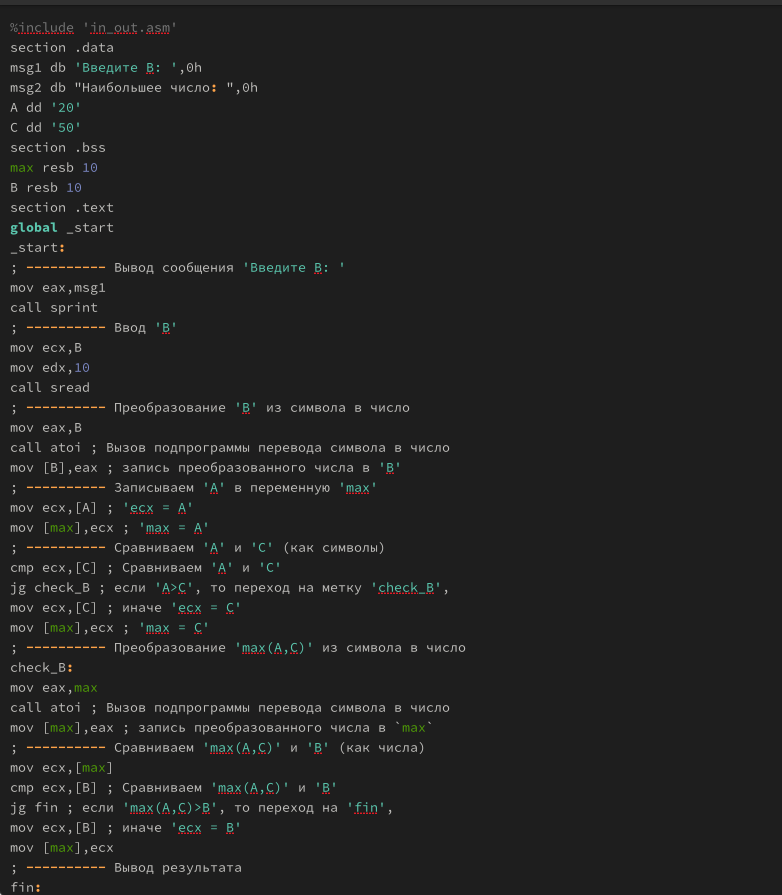
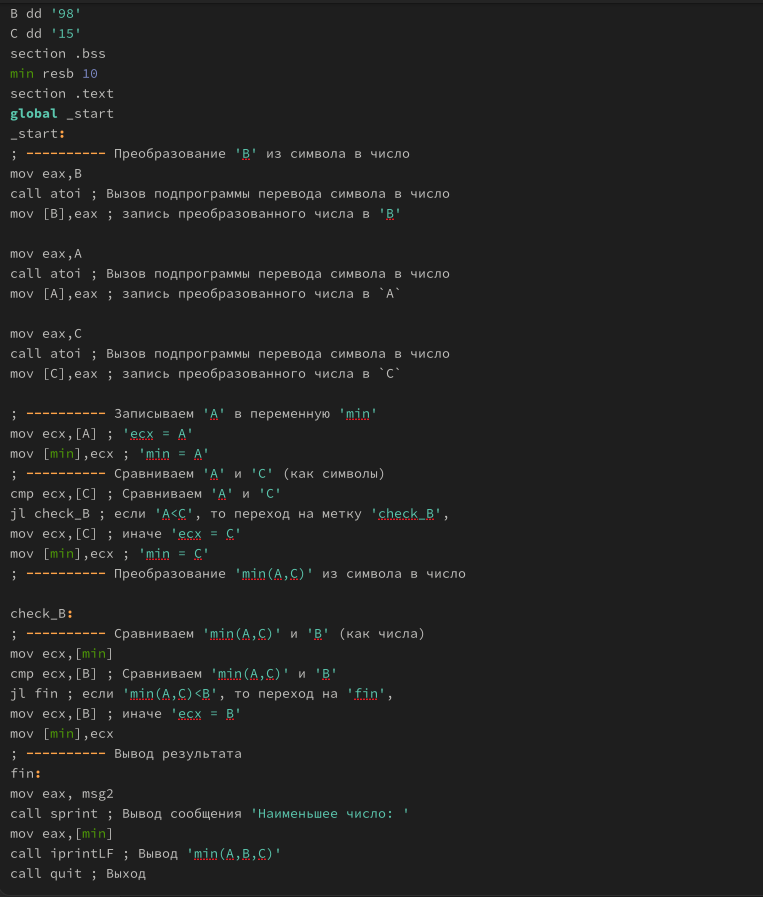
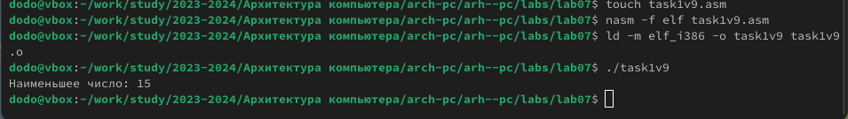
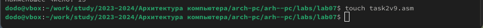

---
## Front matter
title: "Лабораторная работа №7"
subtitle: "Команды безусловного и условного переходов в Nasm. Программирование ветвлений"
author: "Глобин Никита Анатольевич"

## Generic otions
lang: ru-RU
toc-title: "Содержание"

## Bibliography
bibliography: bib/cite.bib
csl: pandoc/csl/gost-r-7-0-5-2008-numeric.csl

## Pdf output format
toc: true # Table of contents
toc-depth: 2
lof: true # List of figures
lot: true # List of tables
fontsize: 12pt
linestretch: 1.5
papersize: a4
documentclass: scrreprt
## I18n polyglossia
polyglossia-lang:
  name: russian
  options:
	- spelling=modern
	- babelshorthands=true
polyglossia-otherlangs:
  name: english
## I18n babel
babel-lang: russian
babel-otherlangs: english
## Fonts
mainfont: IBM Plex Serif
romanfont: IBM Plex Serif
sansfont: IBM Plex Sans
monofont: IBM Plex Mono
mathfont: STIX Two Math
mainfontoptions: Ligatures=Common,Ligatures=TeX,Scale=0.94
romanfontoptions: Ligatures=Common,Ligatures=TeX,Scale=0.94
sansfontoptions: Ligatures=Common,Ligatures=TeX,Scale=MatchLowercase,Scale=0.94
monofontoptions: Scale=MatchLowercase,Scale=0.94,FakeStretch=0.9
mathfontoptions:
## Biblatex
biblatex: true
biblio-style: "gost-numeric"
biblatexoptions:
  - parentracker=true
  - backend=biber
  - hyperref=auto
  - language=auto
  - autolang=other*
  - citestyle=gost-numeric
## Pandoc-crossref LaTeX customization
figureTitle: "Рис."
tableTitle: "Таблица"
listingTitle: "Листинг"
lofTitle: "Список иллюстраций"
lotTitle: "Список таблиц"
lolTitle: "Листинги"
## Misc options
indent: true
header-includes:
  - \usepackage{indentfirst}
  - \usepackage{float} # keep figures where there are in the text
  - \floatplacement{figure}{H} # keep figures where there are in the text
---

# Цель работы

Изучение команд условного и безусловного переходов. Приобретение навыков написания
программ с использованием переходов. Знакомство с назначением и структурой файла
листинга.

# Задание

Реализация переходов в NASM  
Изучение структуры файлы листинга  
Задание для самостоятельной работы  

# Выполнение лабораторной работы

## Реализация переходов в NASM

1. Переходим в католог lab07 и создаём файл lab7-1.asm (рис. [-@fig:001]).

{#fig:001 width=70%}

2. переписываем программу из ТУИС в наш файл (рис. [-@fig:002]).

{#fig:002 width=70%}

3. компилируем и запускаем этот файл (рис. [-@fig:003]).

{#fig:003 width=70%}

4. теперь переписываем программу как показано в лабораторной работе (рис. [-@fig:004]).

{#fig:004 width=70%}

5. компилируем и запускаем этот файл (рис. [-@fig:005]).

{#fig:005 width=70%}

6. создаём файл lab7-2.asm  и пишем в нём код новой программы(рис. [-@fig:006]).

{#fig:006 width=70%}

7. компилируем и запускаем этот файл (рис. [-@fig:007]).

{#fig:007 width=70%}

## Изучение структуры файлы листинга

1. создаём файл листинга через команду nasm -f elf -l lab7-2.lst lab7-2.asm (рис. [-@fig:008]).

{#fig:008 width=70%}

2. открываем этот файл командой mcedit lab7-2.lst (рис. [-@fig:009]).

{#fig:009 width=70%}

тут в строке: (рис. [-@fig:0010]).
1. Строка 51: push eax Содержимое регистра eax помещается в стек. Это значение необходимо для последующей операции вывода.
2. Строка 53: call sprint Вызывается функция sprint. эта функция, отвечает за вывод строки на экран. Аргументы для этой функции были предварительно подготовлены и помещены в стек.
3. Строка 55: pop eax Значение, которое было ранее помещено в стек на строке 51, извлекается и помещается обратно в регистр eax. Это делается для того, чтобы восстановить исходное состояние регистра после выполнения функции sprint.

{#fig:010 width=70%}

3. открываем lab7-2.asm и попробуем намеренно допустить ошибку в нашем коде, убрав у команды move 1 операнд  (рис. [-@fig:0011]).

{#fig:011 width=70%}

4. компилируем и запускаем этот файл (рис. [-@fig:012]).

{#fig:012 width=70%}

5. открываем листинговый файл и видим что там тоже сообщается об ошибке (рис. [-@fig:013]).

{#fig:013 width=70%}

## Задание для самостоятельной работы

1. Создадим файл для выполнения самостоятельной работы. Мой вариант - 9 (рис. [-@fig:014]).

{#fig:014 width=70%}

Напишем код для выполнения задания. Код выглядит так (рис. [-@fig:015]).

{#fig:015 width=70%}

2. Соберём, запустим его и посмотрим на результат (рис. [-@fig:016]).

{#fig:016 width=70%}

3. Теперь создадим второй файл самостоятельной работы для второго задания (рис. [-@fig:017]).

{#fig:017 width=70%}

4. Код будет выглядеть так (рис. [-@fig:018]).

{#fig:018 width=70%}

5. Соберём исполняемый файл и запустим его (рис. [-@fig:019]).

{#fig:019 width=70%}

# Выводы

В результате работы над лабораторной работой были написаны программы, которые используют команды условных и безусловных переходов, были получены навыки работы с этими командами, а также были созданы и успешно прочитаны листинги для некоторых из программ.

# Список литературы{.unnumbered}

