---
## Front matter
title: "Лабораторная работа №8"
subtitle: "Программирование цикла. Обработка аргументов командной строки"
author: "Глобин Никита Анатольевич"

## Generic otions
lang: ru-RU
toc-title: "Содержание"

## Bibliography
bibliography: bib/cite.bib
csl: pandoc/csl/gost-r-7-0-5-2008-numeric.csl

## Pdf output format
toc: true # Table of contents
toc-depth: 2
lof: true # List of figures
lot: true # List of tables
fontsize: 12pt
linestretch: 1.5
papersize: a4
documentclass: scrreprt
## I18n polyglossia
polyglossia-lang:
  name: russian
  options:
	- spelling=modern
	- babelshorthands=true
polyglossia-otherlangs:
  name: english
## I18n babel
babel-lang: russian
babel-otherlangs: english
## Fonts
mainfont: IBM Plex Serif
romanfont: IBM Plex Serif
sansfont: IBM Plex Sans
monofont: IBM Plex Mono
mathfont: STIX Two Math
mainfontoptions: Ligatures=Common,Ligatures=TeX,Scale=0.94
romanfontoptions: Ligatures=Common,Ligatures=TeX,Scale=0.94
sansfontoptions: Ligatures=Common,Ligatures=TeX,Scale=MatchLowercase,Scale=0.94
monofontoptions: Scale=MatchLowercase,Scale=0.94,FakeStretch=0.9
mathfontoptions:
## Biblatex
biblatex: true
biblio-style: "gost-numeric"
biblatexoptions:
  - parentracker=true
  - backend=biber
  - hyperref=auto
  - language=auto
  - autolang=other*
  - citestyle=gost-numeric
## Pandoc-crossref LaTeX customization
figureTitle: "Рис."
tableTitle: "Таблица"
listingTitle: "Листинг"
lofTitle: "Список иллюстраций"
lotTitle: "Список таблиц"
lolTitle: "Листинги"
## Misc options
indent: true
header-includes:
  - \usepackage{indentfirst}
  - \usepackage{float} # keep figures where there are in the text
  - \floatplacement{figure}{H} # keep figures where there are in the text
---

# Цель работы

Научиться работать с циклами на языке Ассемблера, а также научиться обрабатывать аргументы командной строки

# Задание
Реализация циклов в NASM  
Обработка аргументов командной строки  
Задание для самостоятельной работы  

# Выполнение лабораторной работы

## Реализация циклов в NASM

1. Для начала выполнения лабораторной работы создадим рабочую директорию и файл lab8-1.asm (рис. [-@fig:001]).

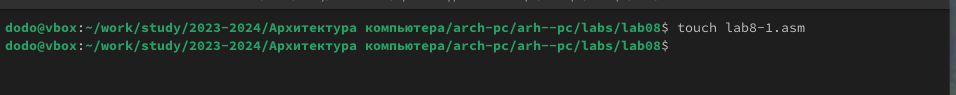{#fig:001 width=70%}

2. Дальше впишем программу и запустим её (рис. [-@fig:002]).

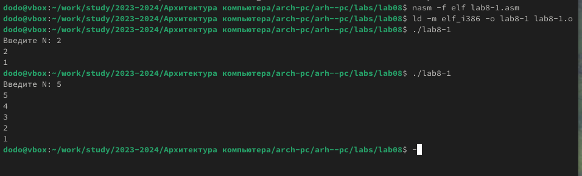{#fig:002 width=70%}

3. немного перепившим программу и запустим (рис. [-@fig:003]).

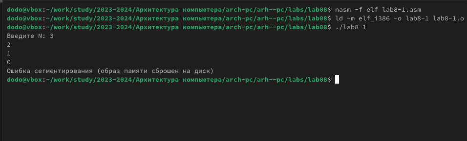{#fig:003 width=70%}

всё работает корректно 

## Обработка аргументов командной строки

1. создаём новый файл и пишем в нём программу (рис. [-@fig:004]).

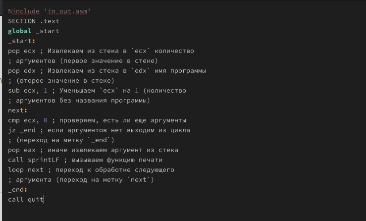{#fig:004 width=70%}

2. Компилируем программу и запускаем её (рис. [-@fig:005]).

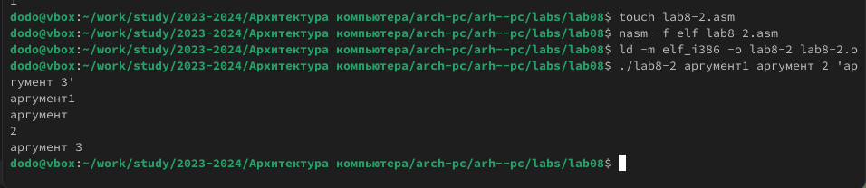{#fig:005 width=70%}

3. создаём новый файл и пишем в нём программу (рис. [-@fig:006]).

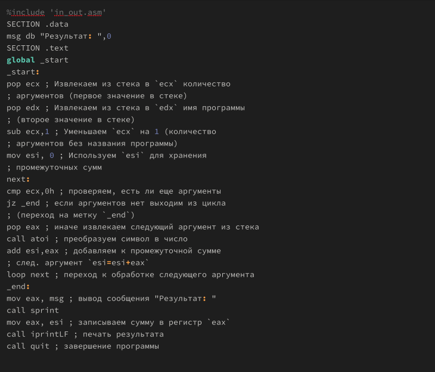{#fig:006 width=70%}

4. Компилируем программу и запускаем её (рис. [-@fig:007]).

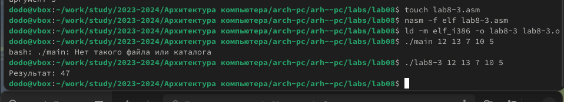{#fig:007 width=70%}

5. Изменим текст программы из листинга 8.3 для вычисления произведения аргументов командной строки(рис. [-@fig:008]).

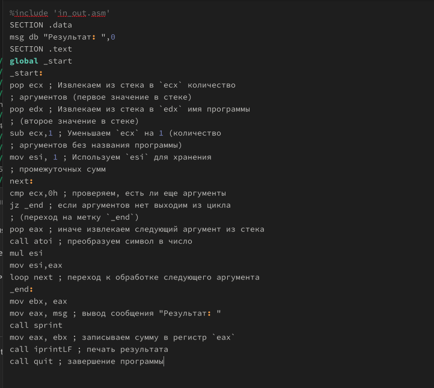{#fig:008 width=70%}

6. Компилируем программу и запускаем её (рис. [-@fig:009]).

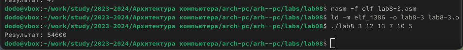{#fig:009 width=70%}

## Задание для самостоятельной работы

1. Пишем программу для решения 9 задания (рис. [-@fig:010]).

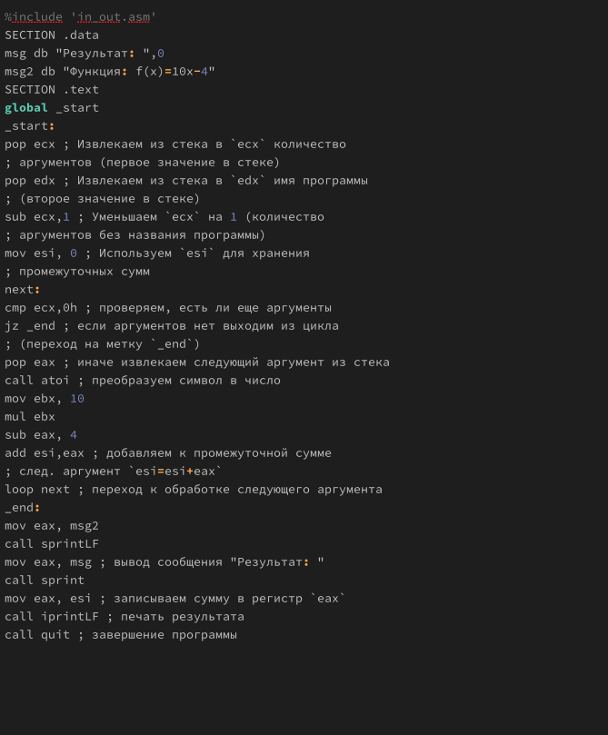{#fig:010 width=70%}

2. Компилируем программу и запускаем её (рис. [-@fig:011]).

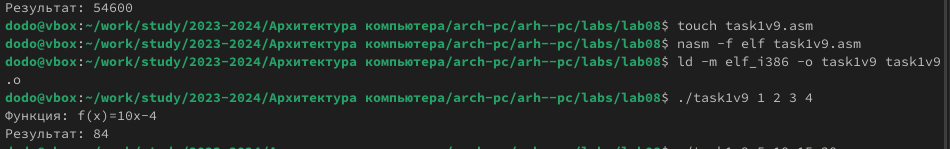{#fig:011 width=70%}

# Выводы

В результате выполнения лабораторной работы были получены навыки работы с циклами и обработкой аргументов из командной строки. Были написаны программы, использующие все вышеописанные аспекты

# Список литературы{.unnumbered}

