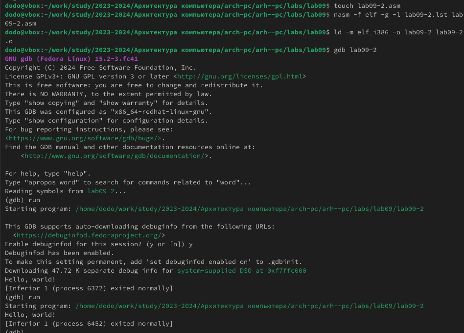
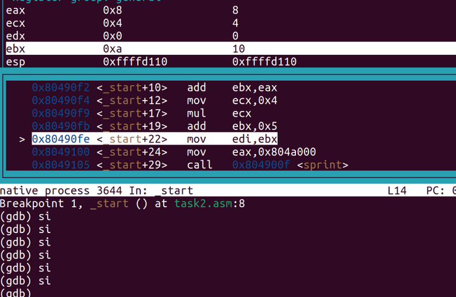

---
## Front matter
title: "Лабораторная работа №9"
subtitle: "Понятие подпрограммы. Отладчик GDB"
author: "Глобин Никита Анатольевич"

## Generic otions
lang: ru-RU
toc-title: "Содержание"

## Bibliography
bibliography: bib/cite.bib
csl: pandoc/csl/gost-r-7-0-5-2008-numeric.csl

## Pdf output format
toc: true # Table of contents
toc-depth: 2
lof: true # List of figures
lot: true # List of tables
fontsize: 12pt
linestretch: 1.5
papersize: a4
documentclass: scrreprt
## I18n polyglossia
polyglossia-lang:
  name: russian
  options:
	- spelling=modern
	- babelshorthands=true
polyglossia-otherlangs:
  name: english
## I18n babel
babel-lang: russian
babel-otherlangs: english
## Fonts
mainfont: IBM Plex Serif
romanfont: IBM Plex Serif
sansfont: IBM Plex Sans
monofont: IBM Plex Mono
mathfont: STIX Two Math
mainfontoptions: Ligatures=Common,Ligatures=TeX,Scale=0.94
romanfontoptions: Ligatures=Common,Ligatures=TeX,Scale=0.94
sansfontoptions: Ligatures=Common,Ligatures=TeX,Scale=MatchLowercase,Scale=0.94
monofontoptions: Scale=MatchLowercase,Scale=0.94,FakeStretch=0.9
mathfontoptions:
## Biblatex
biblatex: true
biblio-style: "gost-numeric"
biblatexoptions:
  - parentracker=true
  - backend=biber
  - hyperref=auto
  - language=auto
  - autolang=other*
  - citestyle=gost-numeric
## Pandoc-crossref LaTeX customization
figureTitle: "Рис."
tableTitle: "Таблица"
listingTitle: "Листинг"
lofTitle: "Список иллюстраций"
lotTitle: "Список таблиц"
lolTitle: "Листинги"
## Misc options
indent: true
header-includes:
  - \usepackage{indentfirst}
  - \usepackage{float} # keep figures where there are in the text
  - \floatplacement{figure}{H} # keep figures where there are in the text
---

# Цель работы

Приобретение навыков написания программ с использованием подпрограмм. Знакомство
с методами отладки при помощи GDB и его основными возможностями.

# Задание

1. Цель работы  
2. Выполнение лабораторной работы  
3. Выполнение задания для самостоятельной работы  
4. Выводы  

# Выполнение лабораторной работы

1. создаём файл и переписываем в него код (рис. [-@fig:001]).

{#fig:001 width=70%}

компилируем и запускаем (рис. [-@fig:002]).

{#fig:002 width=70%}

изменяем программу (рис. [-@fig:003]).

{#fig:003 width=70%}

компилируем и запускаем (рис. [-@fig:004]).

{#fig:004 width=70%}

2. создаём файл и переписываем в него код (рис. [-@fig:005]).

{#fig:005 width=70%}

запускаем отладчик(рис. [-@fig:006]).

{#fig:006 width=70%}

Проверьте работу программы, запустив ее в оболочке GDB (рис. [-@fig:007]).

{#fig:007 width=70%}

Посмотрим дисассимилированный код программы (рис. [-@fig:008]).

{#fig:008 width=70%}

переключим на отображение команд с Intel’овским синтаксисом (рис. [-@fig:009]).

{#fig:009 width=70%}

3. Добавление точек останова (рис. [-@fig:010]).

{#fig:010 width=70%}

Посмотрите значение переменной msg1 по имени (рис. [-@fig:011]) (рис. [-@fig:012]).

{#fig:011 width=70%}

{#fig:012 width=70%}

узнаем значение ячейки (рис. [-@fig:013]).

{#fig:013 width=70%}

поменяем значение ячейки (рис. [-@fig:014]).

{#fig:014 width=70%}

Выведете в различных форматах значение регистра edx (рис. [-@fig:015]).

{#fig:015 width=70%}

{#fig:016 width=70%}

Разница в выводе p/s $edx зависит от содержимого регистра $edx:

Если значение регистра указывает на строку, выводится строка.

Если значение регистра — просто число или некорректный адрес, вывод будет ошибочным либо числовым.

5. Обработка аргументов командной строки в GDB

Скопируем файл lab8-2.asm, созданный при выполнении лабораторной работы №8,
с программой выводящей на экран аргументы командной строки (Листинг 8.2) в файл с
именем lab09-3.asm

компилируем файл (рис. [-@fig:018]).

{#fig:018 width=70%}

запускаем отладчик для программы (рис. [-@fig:020]).

{#fig:020 width=70%}

Для начала установим точку останова перед первой инструкцией в программе и запустим ее (рис. [-@fig:021]).

{#fig:021 width=70%}

проведём запуск программы при разных условиях (рис. [-@fig:022]).

{#fig:022 width=70%}

Шаг изменения адреса равен 4 байта из-за:
1. 32-битной архитектуры, где указатели имеют размер 4 байта.
2. Организации стека, использующего выравнивание по границе слова для указателей.

## Выполнение задания для самостоятельной работы

Скопируем файл первого задания прошлой самостоятельной работы. Нам нужно переписать его так, чтобы он использовал для авчисления выражения подпрограмму (рис. [-@fig:023]).

{#fig:023 width=70%}

Соберём его и проверим корректность выполнения (рис. [-@fig:024]).

{#fig:024 width=70%}

Создадим файл второго задания самостоятельной работы и вставим в него код из листинга 9.3. А затем соберём его и запустим (рис. [-@fig:025]).

{#fig:025 width=70%}

Как видим, код считает значение выражения неправильно. Загрузим его в gdb (рис. [-@fig:026]).

{#fig:026 width=70%}

Переключим его на синтаксис intel. Включим графическое отображение кода. Включеним графическое отображение значений регистров. Установим брейкпоинт на _start и начнём построчно выполнять код 

{#fig:027 width=70%}

{#fig:028 width=70%}

{#fig:029 width=70%}

{#fig:030 width=70%}

Как видим, мы должны были умножить значение регистра ebx, но умножили регистр eax. Нам необходимо все результаты хранить в регистре eax. Изменим код (рис. [-@fig:031]).

{#fig:031 width=70%}

И проверим корректность его выполнения (рис. [-@fig:032]).

{#fig:032 width=70%}

# Выводы

В результате выполнения лабораторной работы были получены представления о работе подпрограмм, а также было реализовано несколько программ, использующих подпрограммы. Также, были получены навыки работы с базовым функионалом gdb, и с помощью gdb была отловлена ошибка в коде программы. Я уверен что эти навыки очень помогут мне в будущих проектах.

# Список литературы{.unnumbered}

::: 
:::
